# Data Science Koans - Architecture Diagrams

## System Architecture Overview


## Learning Path Flow

```mermaid
graph LR
    START[Start] --> L1[Level 1: Foundation]
    L1 --> L2[Level 2: Data Prep]
    L2 --> L3[Level 3: Modeling]
    L3 --> L4[Level 4: Advanced]
    L4 --> L5[Level 5: Best Practices]
    L5 --> COMPLETE[🎓 Complete!]
    
    style START fill:#e1f5e1
    style COMPLETE fill:#ffe1e1
    style L1 fill:#e3f2fd
    style L2 fill:#fff3e0
    style L3 fill:#f3e5f5
    style L4 fill:#fce4ec
    style L5 fill:#e0f2f1
```



## Koan Execution Flow

```mermaid
sequenceDiagram
    participant L as Learner
    participant N as Notebook
    participant V as Validator
    participant P as ProgressTracker
    
    L->>N: Read koan explanation
    L->>N: Write solution in TODO
    L->>N: Run validation cell
    N->>V: Call validation function
    
    alt Solution Correct
        V->>V: Run assertions (pass)
        V->>P: Mark koan complete
        V->>N: Display ✅ SUCCESS
        P->>P: Update mastery levels
        N->>L: Show next koan
    else Solution Incorrect
        V->>V: Assertion fails
        V->>N: Display ❌ FAILED + hint
        N->>L: Review and retry
    end
```



## Module Organization


## Content Progression Map


## Validation Framework Architecture


## Data Flow


## Mastery Calculation

```mermaid
graph TB
    START[Completed Koans] --> GROUP[Group by Topic]
    GROUP --> CALC[Calculate % Complete]
    CALC --> WEIGHT[Apply Difficulty Weights]
    WEIGHT --> SCORE[Mastery Score 0-100%]
    
    SCORE --> L1{Score >= 90%}
    SCORE --> L2{Score >= 70%}
    SCORE --> L3{Score >= 50%}
    
    L1 -->|Yes| M1[🏆 Master]
    L2 -->|Yes| M2[⭐ Proficient]
    L3 -->|Yes| M3[📚 Learning]
    L3 -->|No| M4[🌱 Beginner]
    
    style M1 fill:#4caf50
    style M2 fill:#8bc34a
    style M3 