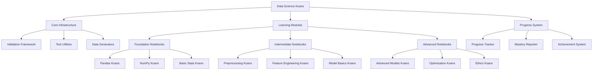

# System Patterns and Architecture

## Overall System Architecture



## Module Organization

### Level 1: Foundation (Beginner)
**Notebooks 01-03**
- 01_numpy_fundamentals.ipynb
- 02_pandas_essentials.ipynb
- 03_data_exploration.ipynb

### Level 2: Data Preparation (Beginner-Intermediate)
**Notebooks 04-06**
- 04_data_cleaning.ipynb
- 05_data_transformation.ipynb
- 06_feature_engineering_basics.ipynb

### Level 3: Model Fundamentals (Intermediate)
**Notebooks 07-09**
- 07_regression_basics.ipynb
- 08_classification_basics.ipynb
- 09_model_evaluation.ipynb

### Level 4: Advanced Techniques (Intermediate-Advanced)
**Notebooks 10-13**
- 10_clustering.ipynb
- 11_dimensionality_reduction.ipynb
- 12_ensemble_methods.ipynb
- 13_hyperparameter_tuning.ipynb

### Level 5: Best Practices (Advanced)
**Notebooks 14-15**
- 14_model_selection_pipeline.ipynb
- 15_ethics_and_bias.ipynb

## Key Design Patterns

### Koan Structure Pattern
Each koan follows this structure:
```python
# === KOAN [NUMBER]: [Title] ===
# Learning Objective: [What you'll learn]
# Difficulty: [Beginner/Intermediate/Advanced]

# [Conceptual explanation]

# TODO: [Specific instruction]
def solution():
    # Your code here
    pass

# Validation
validate_koan_[number](solution)
```

### Validation Framework Pattern
```python
class KoanValidator:
    def __init__(self, koan_id, description):
        self.koan_id = koan_id
        self.description = description
        self.test_cases = []
    
    def add_test(self, test_func, error_msg):
        self.test_cases.append((test_func, error_msg))
    
    def validate(self, solution):
        # Run all tests
        # Provide detailed feedback
        # Update progress
        pass
```

### Progress Tracking Pattern
```python
class ProgressTracker:
    def __init__(self):
        self.completed_koans = set()
        self.mastery_scores = {}
    
    def mark_complete(self, koan_id, score):
        # Update completion status
        # Calculate mastery level
        # Generate report
        pass
    
    def get_next_koan(self):
        # Recommend next appropriate koan
        pass
```

### Data Generation Pattern
```python
class DataGenerator:
    @staticmethod
    def generate_for_koan(koan_type, params):
        # Create appropriate synthetic data
        # Ensure properties needed for the koan
        # Return data and expected results
        pass
```

## Component Relationships

### Core Infrastructure Layer
- **Validation Framework**: Checks koan solutions and provides feedback
- **Test Utilities**: Helper functions for common testing patterns
- **Data Generators**: Create synthetic datasets for exercises
- **Progress System**: Tracks completion and mastery

### Learning Content Layer
- **Notebooks**: Organized by topic and difficulty
- **Koans**: Individual exercises within notebooks
- **Explanations**: Conceptual material accompanying koans
- **Solutions**: Reference implementations (separate file)

### Integration Points
1. Each notebook imports validation framework
2. Koans use data generators for consistent test data
3. Validation results feed progress tracker
4. Progress tracker informs navigation suggestions

## Critical Implementation Paths

### Path 1: Koan Execution Flow
```
User reads concept → Writes solution → Runs validation cell → 
Receives feedback → Iterates if needed → Marks complete → 
Updates progress → Moves to next koan
```

### Path 2: Progress Tracking Flow
```
Koan validation → Calculate score → Update tracker → 
Check mastery threshold → Update module status → 
Generate report → Suggest next steps
```

### Path 3: Data Flow
```
Koan requirements → Data generator → Synthetic dataset → 
User manipulation → Validation comparison → 
Feedback generation
```

## Architectural Decisions

### Decision 1: Jupyter Notebooks as Primary Interface
**Rationale**: Provides integrated environment for learning, coding, and immediate feedback without context switching.

### Decision 2: In-Notebook Validation
**Rationale**: Keeps validation logic close to exercises; easier to understand and debug.

### Decision 3: Progressive Data Complexity
**Rationale**: Start with simple synthetic data to isolate concepts, gradually introduce real-world complexity.

### Decision 4: Modular Notebook Structure
**Rationale**: Learners can focus on specific topics; easier to maintain and extend.

### Decision 5: Separate Solutions File
**Rationale**: Prevents accidental spoilers while providing reference for stuck learners.

### Decision 6: JSON-based Progress Storage
**Rationale**: Simple, human-readable, version-control friendly, easy to reset.

## File Structure
```
datascience-koans/
├── README.md
├── requirements.txt
├── setup.py
├── koans/
│   ├── __init__.py
│   ├── core/
│   │   ├── __init__.py
│   │   ├── validator.py
│   │   ├── progress.py
│   │   └── data_gen.py
│   ├── notebooks/
│   │   ├── 01_numpy_fundamentals.ipynb
│   │   ├── 02_pandas_essentials.ipynb
│   │   └── ... (all other notebooks)
│   └── solutions/
│       └── solutions.py
├── data/
│   └── progress.json
├── tests/
│   └── test_validator.py
└── memory-bank/
    └── (documentation)